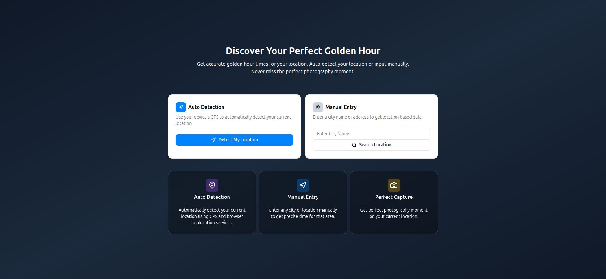

# Golden Hour
Find the perfect time and light for capture stunning photos



## Getting Started

- create .env file
- copy the .env.example to .env
- run your app
```
npm run dev
```

## Technology
- React.JS
- Public API
- Geolocation API
